## Introduction

The data is obtained from [ESPEN
database](https://espen.afro.who.int/tools-resources/download-data)

## Load libraries

``` r
extrafont::loadfonts(device="win", quiet = T)
```

``` r
suppressMessages({
  library(sf);
  library(tidyverse);
  library(rgdal);
  library(raster);
  library(RColorBrewer);
  library(rgeos);
  library(ggspatial);
  library(INLA);
  library(INLAutils);
  library(tictoc);
  library(sp);
  library(cowplot);
  library(ggcorrplot);
  library(FactoMineR)
  library(factoextra)
  })
```

## Loading the data

``` r
ghana_prev_site <- read.csv("data/data-GH-Oncho-sitelevel.csv", header = T)

ghana_prev_clean <- ghana_prev_site %>% filter(Georeliability == 1)

ghana_prev_clean2 <- ghana_prev_clean %>% dplyr::select(IU_NAME, IU_ID, LocationName, Longitude, Latitude, SurveyYear, Period, SurveyMonth, Method_0, Method_1, Method_2, Examined, Positive, Prevalence) %>% mutate(IU_NAME = as.factor(IU_NAME), IU_ID = as.numeric(IU_ID), LocationName = as.factor(LocationName), Longitude = as.numeric(Longitude), Latitude  = as.numeric(Latitude), SurveyYear = as.numeric(SurveyYear), SurveyMonth = as.factor(SurveyMonth), Period = as.factor(Period), Method_0 = as.factor(Method_0), Method_1 = as.factor(Method_1), Method_2 = as.factor(Method_2), Examined = as.numeric(Examined), Positive = as.numeric(Positive), Prevalence = as.numeric(Prevalence))

summary(ghana_prev_clean2)
```

    ##                  IU_NAME        IU_ID                     LocationName
    ##  Wa East             : 76   Min.   :21380   HIAMPE              : 16  
    ##  Pru                 : 71   1st Qu.:21425   ASUBENDE            : 15  
    ##  Banda               : 56   Median :21519   FAOWOMANG           : 15  
    ##  Bole                : 56   Mean   :21500   WIDENABA            : 12  
    ##  Kassena Nankana West: 40   3rd Qu.:21549   KAYORO BALIU (DETAIL: 11  
    ##  West Gonja          : 35   Max.   :21603   KULUN               : 11  
    ##  (Other)             :745   NA's   :6       (Other)             :999  
    ##    Longitude          Latitude        SurveyYear           Period   
    ##  Min.   :-2.9210   Min.   : 4.992   Min.   :1975   2001 - 2005:117  
    ##  1st Qu.:-2.0422   1st Qu.: 7.758   1st Qu.:1990   2006 - 2010:197  
    ##  Median :-1.3500   Median : 8.730   Median :1998   2011 - 2016:104  
    ##  Mean   :-1.2618   Mean   : 8.801   Mean   :1997   Before 2001:661  
    ##  3rd Qu.:-0.4899   3rd Qu.:10.130   3rd Qu.:2006                    
    ##  Max.   : 1.0357   Max.   :11.089   Max.   :2013                    
    ##                                                                     
    ##    SurveyMonth               Method_0              Method_1   
    ##          :247                    :247   Parasitological:1079  
    ##  November:120   Impact Assessment:500                         
    ##  May     :108   Mapping          :332                         
    ##  October :101                                                 
    ##  December: 93                                                 
    ##  January : 92                                                 
    ##  (Other) :318                                                 
    ##                        Method_2       Examined        Positive     
    ##  Parasitology (Skin biopsy):1079   Min.   :  0.0   Min.   :  0.00  
    ##                                    1st Qu.: 98.5   1st Qu.:  2.00  
    ##                                    Median :147.0   Median :  9.00  
    ##                                    Mean   :175.5   Mean   : 37.37  
    ##                                    3rd Qu.:231.0   3rd Qu.: 43.00  
    ##                                    Max.   :925.0   Max.   :576.00  
    ##                                                    NA's   :2       
    ##    Prevalence     
    ##  Min.   :0.00000  
    ##  1st Qu.:0.01575  
    ##  Median :0.06985  
    ##  Mean   :0.17954  
    ##  3rd Qu.:0.26852  
    ##  Max.   :0.88851  
    ##  NA's   :2

``` r
# All the data from skin snipping - no REMO data

# Select the data used for mapping
ghana_prev_clean3 <- ghana_prev_clean2 %>% dplyr::select(Longitude, Latitude, SurveyYear, Period, Method_0, Examined, Positive, Prevalence) %>% mutate()

table(ghana_prev_clean3$Period, ghana_prev_clean3$Method_0)
```

    ##              
    ##                   Impact Assessment Mapping
    ##   2001 - 2005   0                95      22
    ##   2006 - 2010 143                54       0
    ##   2011 - 2016 104                 0       0
    ##   Before 2001   0               351     310

``` r
# Most of the data that does not have the label were collected between 2006 - 2016
```

``` r
## Ghana map boundary - level 1/updated
ghana_map_1 <- readOGR("data/gadm41_GHA_shp/gadm41_GHA_1.shp", verbose = FALSE) %>% st_as_sf()
```

### Convert to spatial object

``` r
coordinates(ghana_prev_clean3) <- (ghana_prev_clean3[, c("Longitude","Latitude")])

ghana_prev_sf <- ghana_prev_clean3 %>% st_as_sf() 
st_crs(ghana_prev_sf) = 4326

# convert to UTM - planar CRS transformation
epsg_ghana_UTM <- 32630
st_crs(epsg_ghana_UTM)$proj4string
```

    ## [1] "+proj=utm +zone=30 +datum=WGS84 +units=m +no_defs"

``` r
utm_proj_ghana <- st_crs(epsg_ghana_UTM)$proj4string  # "+proj=utm +zone=30 +datum=WGS84 +units=m +no_defs"

ghana_prev_sf <- ghana_prev_sf %>% st_transform(crs = utm_proj_ghana)
ghana_prev_sp <- as(ghana_prev_sf, "Spatial")
```

### Spatial filtering to transition region

``` r
bbox_transition <- readRDS("data/bbox_buffer_transition_ghana.rds") %>% st_as_sf()

# filtering the prevalence data
GT_prev_sp <- intersect(x = ghana_prev_sp, y = bbox_transition)
```

``` r
GT_prev_clean <- data.frame(GT_prev_sp)
GT_prev_clean <- GT_prev_clean %>% mutate(LONG = coords.x1, LAT = coords.x2, optional = NULL) %>% mutate(coords.x1 = NULL, coords.x2 = NULL, Longitude = NULL, Latitude = NULL)

## Omitting observations with missing data
GT_prev_clean <- na.omit(GT_prev_clean)

## Selecting only mapping data
GT_prev_mapping <- GT_prev_clean %>% filter(Method_0 == "Mapping")
```

### Find duplicate observations

``` r
find_duplicate <- function(df){
  i <- duplicated(df[, c("LONG", "LAT")])
  long_dup <- df[i, ]$LONG
  lat_dup <- df[i, ]$LAT
  duplicate_sites <- df %>% filter(LONG %in% long_dup & LAT %in% lat_dup)
  return(duplicate_sites)
}

duplicate_mf <- find_duplicate(df = GT_prev_mapping)
```

``` r
GT_prev_mapdiff <- GT_prev_mapping[ !(GT_prev_mapping$LONG %in% duplicate_mf$LONG), ]
GT_prev_mapdiff %>% summary ## all collected before 2001
```

    ##    SurveyYear           Period                Method_0     Examined    
    ##  Min.   :1978   2001 - 2005: 1                    : 0   Min.   : 28.0  
    ##  1st Qu.:1982   2006 - 2010: 0   Impact Assessment: 0   1st Qu.: 88.5  
    ##  Median :1994   2011 - 2016: 0   Mapping          :36   Median :173.0  
    ##  Mean   :1990   Before 2001:35                          Mean   :180.5  
    ##  3rd Qu.:1997                                           3rd Qu.:240.5  
    ##  Max.   :2001                                           Max.   :601.0  
    ##     Positive        Prevalence            LONG             LAT        
    ##  Min.   :  1.00   Min.   :0.006579   Min.   :568861   Min.   :852450  
    ##  1st Qu.:  8.75   1st Qu.:0.115566   1st Qu.:601398   1st Qu.:870818  
    ##  Median : 37.50   Median :0.292644   Median :641146   Median :897130  
    ##  Mean   : 52.94   Mean   :0.269341   Mean   :656001   Mean   :895854  
    ##  3rd Qu.: 56.00   3rd Qu.:0.402764   3rd Qu.:696237   3rd Qu.:916135  
    ##  Max.   :224.00   Max.   :0.600000   Max.   :836335   Max.   :966105

``` r
# Clean duplicate mf. If all the variables are same, keep only one observation. For, the ones with different prevalence, calculate average  
duplicate_mf2 <- duplicate_mf %>% distinct()
GT_unique_prev <- duplicate_mf2 %>% group_by(LONG, LAT) %>% summarise(Examined = sum(Examined), Positive = sum(Positive), Prevalence = Positive/Examined) 

## select required columns and merge the dataframe
GT_unique_prevmap <- GT_prev_mapdiff %>% dplyr::select(LONG, LAT, Examined, Positive, Prevalence) %>% rbind(GT_unique_prev)
```

## Visualise the prevalence data

### Prevalence histogram

``` r
hist(GT_unique_prevmap$Prevalence, main = "",
     xlab="Onchocerciasis prevalence", ylab = ("Frequency"),
     border="black", 
     col="darkgrey", xlim=c(0,1), cex.lab=1.5, cex.axis=1, cex.main=2, cex.sub=2,
    #  ylim = c(0,225),
     las=1, 
     breaks=25)
```

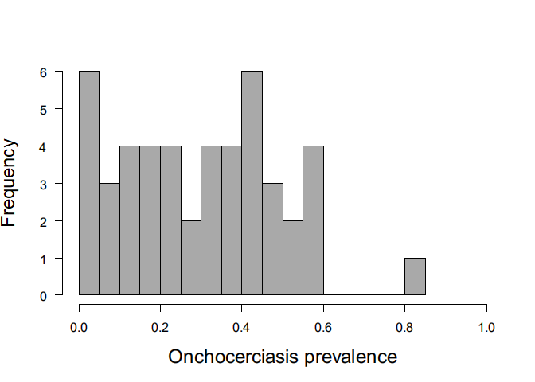<!-- -->

### Ghana prevalence on a map

``` r
# GT_prevmap_sf <- st_as_sf(x = GT_unique_prevmap, coords = c('LONG','LAT'), crs= "+proj=utm +zone=30 +datum=WGS84 +units=m +no_defs")

ghana_map_1_sfutm <- ghana_map_1 %>% st_transform(crs = "+proj=utm +zone=30 +datum=WGS84 +units=m +no_defs")
```

``` r
mypalette <- colorRampPalette(rev(brewer.pal(11, "RdYlBu")))

p <- ggplot(ghana_map_1_sfutm) + 
  geom_sf(col = "black", lty = 1, alpha = 0.01) + coord_sf() +
  geom_sf(data = bbox_transition, alpha = 0) +
  geom_point(data = GT_unique_prevmap, aes(LONG, LAT, fill = Prevalence), color = "black", size = 2, stroke = 1, shape = 21, alpha = .7)+ labs(fill = "Onchocerciasis prevalence") +
  scale_fill_gradientn(colours = mypalette(100)) +
  scale_y_continuous(name=expression(paste("Latitude (",degree,")")), limits=c(844447.4, 973827),expand=c(0,0))+
  scale_x_continuous(name = expression(paste("Longitude (",degree,")")), limits=c(557845.6, 851520.9),expand=c(0,0)) + 
  annotation_scale(location = "br", width_hint = 0.5) +
  annotation_north_arrow(location = "tl", which_north = "true",
        pad_x = unit(0.05, "in"), pad_y = unit(0.05, "in"),
        style = north_arrow_fancy_orienteering) +
  theme_void(base_family = "Arial", base_size = 16) +
  theme(legend.position = "bottom", legend.key.size = unit(2, 'cm'), #change legend key size
        legend.key.height = unit(.5, 'cm'), #change legend key height
        legend.key.width = unit(1.5, 'cm')) +
  guides(fill = guide_colourbar(title.position="top", title.hjust = 0.5))
```

    ## Coordinate system already present. Adding new coordinate system, which will replace the existing one.

``` r
p
```

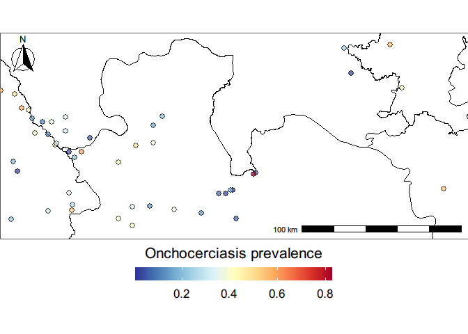<!-- -->

# Variable selection

## Loading the data

``` r
cov_prev <- stack("data/220228_cov_prev.grd")
```

## Extract point data from raster covriates

``` r
covs <- raster::extract(cov_prev, GT_unique_prevmap[c("LONG","LAT")], na.rm = TRUE, df = TRUE)

data_c_covs <- as.data.frame(cbind(GT_unique_prevmap, covs))
data_c_covs <- na.omit(data_c_covs)
```

## Prevalence data: Variable selection

``` r
data_c_covs2 <- data_c_covs
data_c_covs[, c("Examined", "Positive", "LONG", "LAT", "ID")] <- NULL
```

``` r
temp_covariates <- c(names(data_c_covs)[c(3:13, 22:23)], "Prevalence")
temp_data <- data_c_covs[, temp_covariates]

precip_covariates <- c(names(data_c_covs)[14:21], "Prevalence")
precip_data <- data_c_covs[, precip_covariates]

elev_data <- data_c_covs[, c("elevation", "slope", "Prevalence")]
vegind_data <- data_c_covs[, c("EVI01_GT_utm", "NDVI01_GT_utm", "Prevalence")]
hydro_data <- data_c_covs[, c("FC_GT_utm", "TCW01_GT_utm", "SM0001_GT_utm", "distwater_GT_utm", "Prevalence")]

sociodem_data <- data_c_covs[, c("popden0001_GT_utm",
                          "housing2001_GT_utm", "nightlights0001_GT_utm", "Prevalence")]
```

``` r
covs_prev <- data_c_covs %>% dplyr::select(annual_mean_temperature, annual_diurnal_range, temperature_seasonality, maximum_temperature_warmest_month, minimum_temperature_coldest_month, temperature_annual_range, mean_temperature_wettest_quarter, mean_temperature_driest_quarter, mean_temperature_warmest_quarter, mean_temperature_coldest_quarter, isothermality, LST_day_01, LST_night_01, annual_precpitation, precipitation_wettest_month, precipitation_driest_month, precipitation_wettest_quarter, precipitation_dreist_quarter, precipitation_warmest_quarter, precipitation_coldest_quarter, precipitation_seasonality, elevation, slope, NDVI01_GT_utm, EVI01_GT_utm, FC_GT_utm, distwater_GT_utm, TCW01_GT_utm, SM0001_GT_utm, popden0001_GT_utm, housing2001_GT_utm, nightlights0001_GT_utm)

names(covs_prev) <- c("BIO1", "BIO2", paste0("BIO",4:11), "BIO3", paste0("BIO",c(12:14,16:19)), "BIO15", "LSTD", "LSTN", "DEM", "SLP", "NDVI", "EVI", "FC", "DW", "TCW", "SM", "PD", "IHP", "NL")
```

### PCA analysis

``` r
res.pca <- PCA(covs_prev, scale.unit = TRUE, graph = FALSE)
p_pca <- fviz_pca_var(res.pca, col.var = "black") + ggtitle("")
p_pca
```

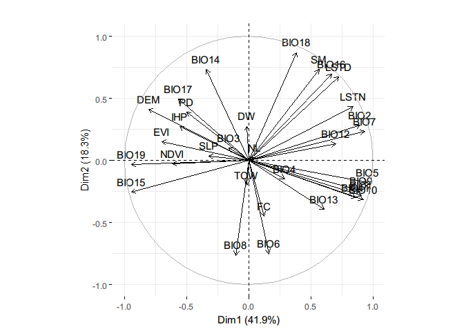<!-- -->

``` r
# eig.val <- get_eigenvalue(res.pca)
```

``` r
p_scree <- fviz_eig(res.pca, addlabels = TRUE, ylim = c(0, 50)) + ggtitle("")
p_scree
```

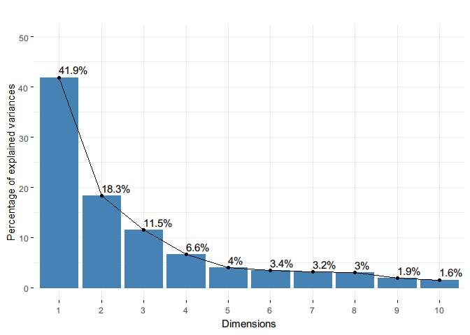<!-- -->

``` r
# var <- get_pca_var(res.pca)
```

``` r
# p <- fviz_cos2(res.pca, choice = "var", axes = 1:3)
```

-   Upto 5 axis included because the cumulative variance explained is
    greater than 80%

``` r
p_contrib <- fviz_contrib(res.pca, choice = "var", axes = 1:5, top = 100) + theme(axis.text.x = element_text(angle=90)) + ggtitle("")
p_contrib
```

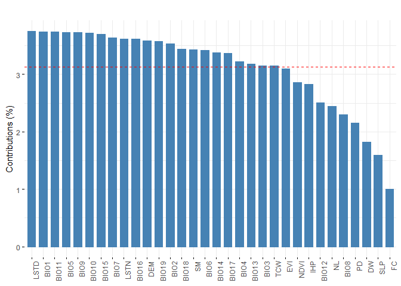<!-- -->

#### Temperature variables

``` r
corr <- cor(temp_data[, 1:13])
p.mat <- cor_pmat(temp_data[, 1:13])
p <- ggcorrplot(corr, type = "lower", # p.mat = p.mat,
   lab = TRUE, digits = 2, insig = "blank")
p
```

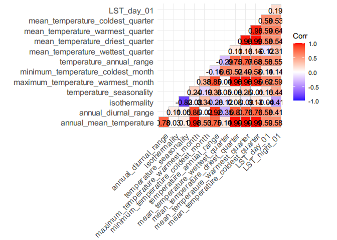<!-- -->

-   `LST_night_01`, `annual_mean_temperature`,
    `temperature_annual_range`, `temperature_seasonality`,
    `minimum_temperature_coldest_month`

``` r
temp_covselected <- c("LST_night_01", "annual_mean_temperature", "temperature_annual_range", "temperature_seasonality", "minimum_temperature_coldest_month")
temp_selected <- data_c_covs[,temp_covselected]
corr <- cor(temp_selected)
p.mat <- cor_pmat(temp_selected)
p <- ggcorrplot(corr, type = "lower", # p.mat = p.mat,
   lab = TRUE, digits = 2, insig = "blank")
p
```

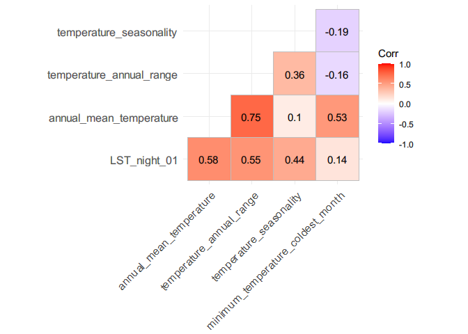<!-- -->

-   `temperature_annual_range` not included as it is correlated with
    `annual_mean_temperature` - \> 0.6

``` r
temp_covselected <- c("LST_night_01", "annual_mean_temperature", "temperature_seasonality", "minimum_temperature_coldest_month")
```

#### Precipitation variables

``` r
corr <- cor(precip_data[, 1:8])
p.mat <- cor_pmat(precip_data[, 1:8])
p <- ggcorrplot(corr, type = "lower", # p.mat = p.mat,
   lab = TRUE, digits = 2, insig = "blank")
p
```

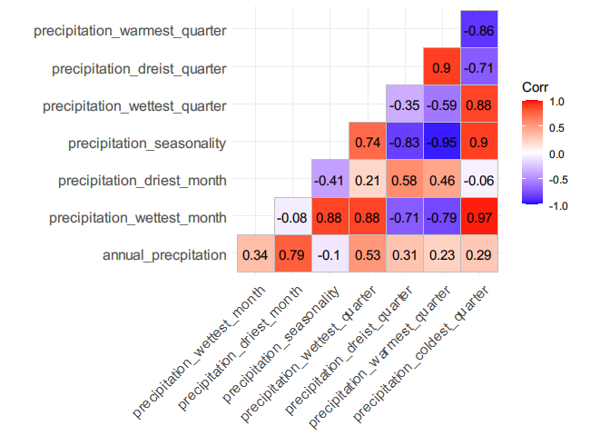<!-- -->

-   “precipitation_coldest_quarter”, “annual_precpitation”,
    “precipitation_warmest_quarter”

``` r
precip_covselected <- c("precipitation_coldest_quarter", "annual_precpitation", "precipitation_warmest_quarter")
precip_selected <- data_c_covs[, precip_covselected]
corr <- cor(precip_selected)
p.mat <- cor_pmat(precip_selected)
p <- ggcorrplot(corr, type = "lower", # p.mat = p.mat,
   lab = TRUE, digits = 2, insig = "blank")
```

-   `precipitation_warmest_quarter` excluded

``` r
precip_covselected <- c("precipitation_coldest_quarter", "annual_precpitation")
```

#### Elevation/slope

``` r
corr <- cor(elev_data[, 1:2])
p.mat <- cor_pmat(elev_data[, 1:2])
p <- ggcorrplot(corr, type = "lower", # p.mat = p.mat,
   lab = TRUE, digits = 2, insig = "blank")
p
```

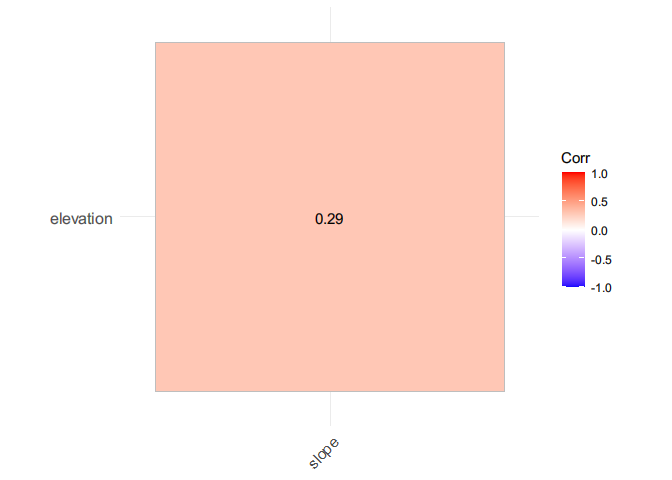<!-- -->
+ both selected

``` r
elev_covselected <- c("elevation", "slope")
```

#### Vegind data

``` r
corr <- cor(vegind_data[, 1:2])
p.mat <- cor_pmat(vegind_data[, 1:2])
p <- ggcorrplot(corr, type = "lower", # p.mat = p.mat,
   lab = TRUE, digits = 2, insig = "blank")
p
```

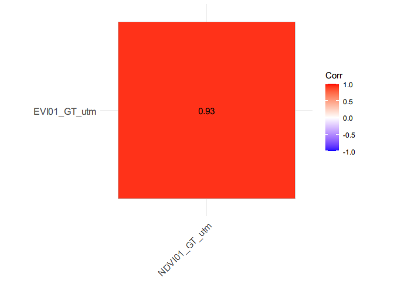<!-- -->
+ `EVI01_GT_utm` selected

``` r
vegind_covselected <- "EVI01_GT_utm"
```

#### Hydro data

``` r
corr <- cor(hydro_data[, 1:4])
p.mat <- cor_pmat(hydro_data[, 1:4])
p <- ggcorrplot(corr, type = "lower", # p.mat = p.mat,
   lab = TRUE, digits = 2, insig = "blank")
p
```

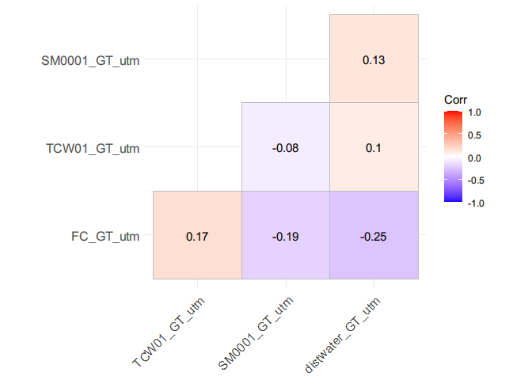<!-- -->
+ All selected

``` r
hydro_covselected <- c("FC_GT_utm", "TCW01_GT_utm", "SM0001_GT_utm", "distwater_GT_utm")
```

#### Socio demographic data

``` r
corr <- cor(sociodem_data[, 1:3])
p.mat <- cor_pmat(sociodem_data[, 1:4])
p <- ggcorrplot(corr, type = "lower", # p.mat = p.mat,
   lab = TRUE, digits = 2, insig = "blank")
p
```

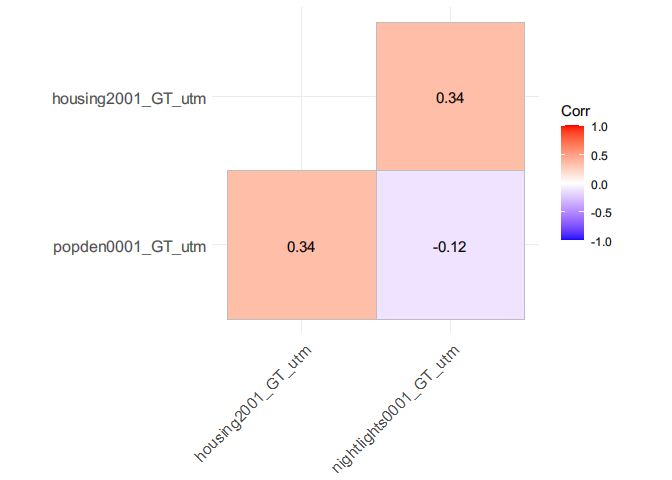<!-- -->
+ All selected

``` r
sociodem_covselected <- c("popden0001_GT_utm", "housing2001_GT_utm", "nightlights0001_GT_utm")
```

#### Round 1 covs

``` r
selected_covs_round1 <- c(temp_covselected, precip_covselected, elev_covselected, vegind_covselected, hydro_covselected, sociodem_covselected)
```

``` r
corr <- cor(data_c_covs[, selected_covs_round1])
p.mat <- cor_pmat(data_c_covs[, selected_covs_round1])
p <- ggcorrplot(corr, type = "lower", # p.mat = p.mat,
   lab = TRUE, digits = 2, insig = "blank")
p
```

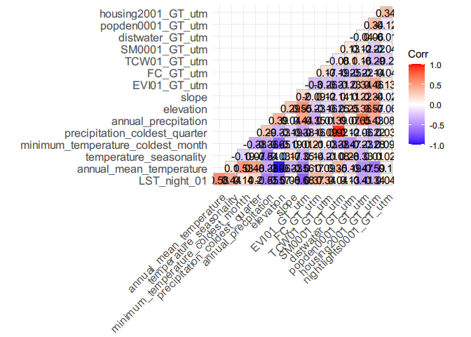<!-- -->

-   `elevation`, `soil_moisture`, `EVI`, `popden0001_GT_utm` removed

``` r
selected_covs_r1 <- selected_covs_round1[c(-7,-9,-12, -14)]
corr <- cor(data_c_covs[, selected_covs_r1])
p.mat <- cor_pmat(data_c_covs[, selected_covs_r1])
p <- ggcorrplot(corr, type = "lower", # p.mat = p.mat,
   lab = TRUE, digits = 2, insig = "blank")
p
```

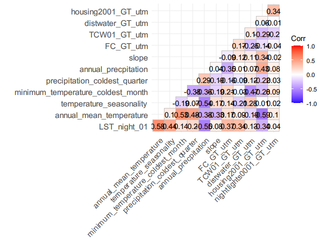<!-- -->

``` r
prevcovs_selected <- cov_prev[[selected_covs_r1]]
```

-   annual mean temperature also removed - it’s similar to LST and
    almost correlated to other variables

``` r
selected_covs_r1 <- c("LST_night_01", "temperature_seasonality", "minimum_temperature_coldest_month", "precipitation_coldest_quarter", "annual_precpitation", "slope", "FC_GT_utm", "TCW01_GT_utm", "distwater_GT_utm", "housing2001_GT_utm", "nightlights0001_GT_utm")

data_c_selectedcovs <- data_c_covs[, selected_covs_r1]
data_c_selectedcovs$Prevalence <- data_c_covs$Prevalence

# prev_selectedcovs_long <- to_long(data = data_c_selectedcovs)
# prev_selectedcovs_long$Prevalence <- prev_selectedcovs_long$Prevalence * 100
# prev_selectedcovs_long$covariates <- as.factor(prev_selectedcovs_long$covariates)
```

-   night lights removed as majority of values 0
-   TCW removed all negative values in data
-   Soil moisture instead of precipitation at coldest quarter -
    interpretable

``` r
selected_covs_r1 <- c("LST_night_01", "temperature_seasonality", "minimum_temperature_coldest_month", "SM0001_GT_utm", "annual_precpitation", "slope", "distwater_GT_utm", "housing2001_GT_utm")

selected_data <- data_c_covs[, selected_covs_r1]
names(selected_data) <- c("Land surface temp (night)", "Temperature seasonality", "Temperature coldest month (min)", "Soil moisture", "Annual precipitation", "Slope", "Distance to river", "Improved housing prevalence")
corr <- cor(selected_data)
p.mat <- cor_pmat(selected_data)
p <- ggcorrplot(corr, type = "lower", # p.mat = p.mat,
   lab = TRUE, digits = 2, insig = "blank")
p
```

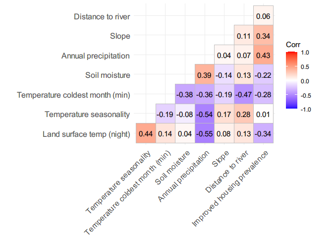<!-- -->

# Model fitting and selection using INLA

We will be calculating different model fit metrics to assess the best
model. + DIC + WAIC

### Loading the data

``` r
prev_cols <- c("LONG", "LAT", "Examined", "Positive", "Prevalence")

data <- data_c_covs2[, c(prev_cols, selected_covs_r1)]
data <- data %>% mutate(X = NULL, N = Examined, CASES = Positive)

data$CASES <- round(data$CASES)
data$N <- round(data$N)
```

``` r
# m <- readRDS("data/bbox_buffer_transition_ghana.rds") 
m <- bbox_transition %>% as_Spatial()

covariates <- stack("data/220228_cov_prev.grd")

varlist <- c("LST_night_01", "temperature_seasonality", "minimum_temperature_coldest_month", 
             "SM0001_GT_utm", "annual_precpitation", "slope", "distwater_GT_utm", "housing2001_GT_utm")

pred_data <- covariates[[varlist]]
pred_data <- aggregate(covariates[[varlist]], fact = 2, fun = mean, na.rm = TRUE)  # 2km grid for prediction

ra <- pred_data
dp <- data.frame(rasterToPoints(ra))
```

``` r
coords <-  cbind(data$LONG, data$LAT)
bdry <- inla.sp2segment(m)
bdry$loc <- inla.mesh.map(bdry$loc)

mesh5 <- inla.mesh.2d(
  loc = coords, boundary = bdry, 
  max.edge = c(15000, 100000),
  cutoff = 7500
)
mesh5$n
```

    ## [1] 586

``` r
mesh5_plot <- autoplot(mesh5) + theme_void() + theme(legend.position = "none")
```

### SPDE and A matrix

``` r
A <- inla.spde.make.A(mesh = mesh5, loc = as.matrix(coords)); dim(A)
```

    ## [1]  46 586

``` r
spde <- inla.spde2.matern(mesh5, alpha=2)

indexs <- inla.spde.make.index(name = "spatial.field", spde$n.spde)
length(indexs)
```

    ## [1] 3

### INLA stack

``` r
df <- data.frame(Intercept = 1, subset(data, select = varlist))

stk <- inla.stack(
    tag = "est",
    data = list(y = data$CASES, numtrials = data$N),
    A = list(1, A),
    effects = list(df, spatial.field = indexs)
  )
```

### Model fitting

``` r
formula01 <-y ~ -1 + Intercept 
formula0 <-y ~ -1 + Intercept + f(spatial.field, model=spde)
# + Soil_moisture + Flow_accumulation + near_river_DIVA + night_lights + mean_housing_2000_15 + Population_density + annual_diurnal_range + annual_precp + f(spatial.field, model=spde) 
```

#### Binomial

``` r
tic()
inla.setOption(num.threads = 12)
model01.binom <- inla(formula01,
            family = "binomial", Ntrials = numtrials,
            data = inla.stack.data(stk, spde = spde),
            control.family = list(link = "logit"),
            control.compute = list(dic = TRUE, waic = TRUE,
                                   cpo = TRUE, config = TRUE,
                                   openmp.strategy="huge"),
            control.predictor = list(
              compute = TRUE, link = 1,
              A = inla.stack.A(stk)
            )
  )
toc()
```

    ## 2.59 sec elapsed

``` r
tic()
inla.setOption(num.threads = 12)
model.binom <- inla(formula0,
            family = "binomial", Ntrials = numtrials,
            data = inla.stack.data(stk, spde = spde),
            control.family = list(link = "logit"),
            control.compute = list(dic = TRUE, waic = TRUE,
                                   cpo = TRUE, config = TRUE,
                                   openmp.strategy="huge"),
            control.predictor = list(
              compute = TRUE, link = 1,
              A = inla.stack.A(stk)
            )
  )
toc()
```

    ## 8.36 sec elapsed

``` r
model_stats <- tibble(Models = c("Binomial without spatial","Binomial"),
       DIC = c(model01.binom$dic$dic, model.binom$dic$dic),
       WAIC = c(model01.binom$waic$waic, model.binom$waic$waic)) 
model_stats # going for a spatial model
```

    ## # A tibble: 2 x 3
    ##   Models                     DIC  WAIC
    ##   <chr>                    <dbl> <dbl>
    ## 1 Binomial without spatial 1906. 1999.
    ## 2 Binomial                  353.  365.

## Testing Meshes

### Fine tuning mesh

``` r
### mesh A
meshA <- inla.mesh.2d(
  loc = coords, boundary = bdry, max.edge = c(10000, 100000),
  cutoff = 3000
)
meshA$n
```

    ## [1] 1126

``` r
meshA_plot <- autoplot(meshA) + theme_void() + theme(legend.position = "none")

### mesh B
meshB <- inla.mesh.2d(
  loc = coords, boundary = bdry, max.edge = c(15000, 100000),
  cutoff = 5000
)
meshB$n
```

    ## [1] 594

``` r
meshB_plot <- autoplot(meshB) + theme_void() + theme(legend.position = "none")

### mesh C
meshC <- inla.mesh.2d(
  loc = coords, boundary = bdry, max.edge = c(10000, 50000),
  cutoff = 6000
)

meshC$n
```

    ## [1] 843

``` r
meshC_plot <- autoplot(meshC) + theme_void() + theme(legend.position = "none")

### mesh D
meshD <- inla.mesh.2d(
  loc = coords, boundary = bdry, max.edge = c(15000, 50000),
  cutoff = 7500
)
meshD$n
```

    ## [1] 586

``` r
meshD_plot <- autoplot(meshD) + theme_void() + theme(legend.position = "none")

### mesh E
meshE <- inla.mesh.2d(
  loc = coords, boundary = bdry, max.edge = c(5000, 100000),
  cutoff = 3000
)
meshE$n
```

    ## [1] 3058

``` r
meshE_plot <- autoplot(meshE) + theme_void() + theme(legend.position = "none")

### mesh F
meshF <- inla.mesh.2d(
  loc = coords, boundary = bdry, max.edge = c(7500, 150000),
  cutoff = 6000
)
meshF$n
```

    ## [1] 842

``` r
meshF_plot <- autoplot(meshF) + theme_void() + theme(legend.position = "none")

meshes <- plot_grid(meshA_plot, meshB_plot, meshC_plot, meshD_plot, meshE_plot, meshF_plot, labels = "AUTO")

meshes
```

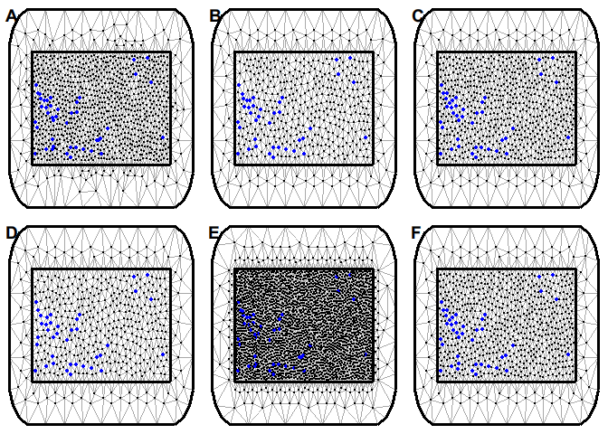<!-- -->

##### Running model on different meshes

``` r
# custom function for stacking the data
stack_data <- function(data, dp, cov_list){
  # stack for estimation stk.e
  df <- data.frame(b0 = 1, subset(data, select = cov_list))
  stk.e <- inla.stack(
    tag = "est",
    data = list(y = data$CASES, numtrials = data$N),
    A = list(1, A),
    effects = list(df, spatial.field = indexs)
  )
  
  # stack for prediction stk.p
  df_p <- data.frame(b0 = 1, subset(dp, select = cov_list))
  stk.p <- inla.stack(
    tag = "pred",
    data = list(y = NA, numtrials = NA),
    A = list(1, Ap),
    effects = list(df_p, spatial.field = indexs))
  
  # stk.full has stk.e and stk.p
  stk.full <- inla.stack(stk.e, stk.p)
  
  return(stk.full)
}
```

``` r
df_1 <- data.frame(Meshes = LETTERS[1:6],
                   DIC = NA,
                   WAIC = NA,
                   time_taken = NA,
                   number_p = NA,
                   mean_sd = NA)
pred_res <- list()

meshes <- list(meshA, meshB, meshC, meshD, meshE, meshF)
ra <- aggregate(covariates[[varlist]], fact = 25, fun = mean, na.rm = TRUE)  # 2km grid for prediction
dp <- data.frame(rasterToPoints(ra))
coop <- cbind(dp$x, dp$y)

predterms <- as.formula(paste("y ~ 0 + b0 +", paste(varlist, collapse =  "+"), "+ f(spatial.field, model = spde)"))

# predterm <- as.formula("y ~ 0 + b0 + f(spatial.field, model = spde)")
pb = txtProgressBar(min = 0, max = length(meshes), initial = 0) 

for (i in 1:length(meshes)) {
  spde <- inla.spde2.matern(meshes[[i]], alpha=2)
  indexs <- inla.spde.make.index(name = "spatial.field", spde$n.spde)
  A <- inla.spde.make.A(mesh = meshes[[i]], loc = as.matrix(coords)); dim(A)
  Ap <- inla.spde.make.A(mesh = meshes[[i]], loc = coop);dim(Ap)
  datastack <- stack_data(data = data, dp = dp, cov_list = varlist)
  inla.setOption(num.threads = 12)
  old <- Sys.time()
  p.res <- inla(predterms,
            family = "binomial", Ntrials = numtrials,
            data = inla.stack.data(datastack, spde = spde),
            control.family = list(link = "logit"),
            control.compute = list(dic = TRUE, waic = TRUE,
                                   cpo = TRUE, config = TRUE,
                                   openmp.strategy="huge"),
            control.predictor = list(
              compute = TRUE, link = 1,
              A = inla.stack.A(datastack)
            )
)
  df_1[i, 4] <- Sys.time() - old
  df_1[i, 2] <- p.res$dic$dic
  df_1[i, 3] <- p.res$waic$waic
  df_1[i, 5] <- meshes[[i]]$n
  
  index <- inla.stack.index(stack = datastack, tag = "pred")$data
  prev_mean <- p.res$summary.fitted.values[index, "mean"]
  prev_sd <-  p.res$summary.fitted.values[index, "sd"]
  pred_res[[i]] <- list(prev_mean, prev_sd)
  df_1[i, 6] <- mean(prev_sd)
  setTxtProgressBar(pb,i)
  cat("\nIteration = ", i, "\n")
  print(Sys.time() - old)
}

df_1

# df_1 %>% write.csv("data/221020_model_meshes_updated.csv")
```

``` r
df_1 <- read.csv("data/221020_model_meshes_updated.csv")
df_1
```

    ##   X Meshes      DIC     WAIC time_taken number_p   mean_sd
    ## 1 1      A 328.5898 325.5058  19.515954     1126 0.3411657
    ## 2 2      B 342.1120 344.7677  21.800993      594 0.3546169
    ## 3 3      C 346.5946 355.7183  27.977950      843 0.3786170
    ## 4 4      D 330.2956 326.0149  38.948466      586 0.3549100
    ## 5 5      E 342.1255 349.3378   1.307725     3058 0.2765611
    ## 6 6      F 343.4023 346.8262  18.364361      842 0.3557615

#INLA Model with prediction

``` r
spde <- inla.spde2.matern(meshA, alpha=2)
indexs <- inla.spde.make.index(name = "spatial.field", spde$n.spde)
length(indexs)
```

    ## [1] 3

``` r
# Make projection matrix --------------------------------------------------
A <- inla.spde.make.A(mesh=meshA,loc=as.matrix(coords));dim(A)
```

    ## [1]   46 1126

``` r
coop <- cbind(dp$x, dp$y)
Ap <- inla.spde.make.A(mesh = meshA, loc = coop);dim(Ap)
```

    ## [1] 11360  1126

``` r
# Model formula ---------------------------------------------------------
predterms <- as.formula(paste("y ~ 0 + b0 +", paste(varlist, collapse =  "+"), "+ f(spatial.field, model = spde)"))

datastack <- stack_data(data = data, dp = dp, cov_list = varlist)
```

``` r
tic()
res <- inla(predterms,
            family = "binomial", Ntrials = numtrials,
            data = inla.stack.data(datastack, spde = spde),
            control.family = list(link = "logit"),
            control.compute = list(dic = TRUE, waic = TRUE,
                                   cpo = TRUE, config = TRUE,
                                   openmp.strategy="huge"),
            control.predictor = list(
              compute = TRUE, link = 1,
              A = inla.stack.A(datastack)
            )
)
toc()
```

``` r
res <- readRDS("data/220301_GT_prev_mesh5_2km.rds")
summary(res)
```

    ## 
    ## Call:
    ##    c("inla(formula = predterms, family = \"binomial\", data = 
    ##    inla.stack.data(datastack, ", " spde = spde), Ntrials = numtrials, 
    ##    control.compute = list(dic = TRUE, ", " waic = TRUE, cpo = TRUE, config 
    ##    = TRUE, openmp.strategy = \"huge\"), ", " control.predictor = 
    ##    list(compute = TRUE, link = 1, A = inla.stack.A(datastack)), ", " 
    ##    control.family = list(link = \"logit\"))") 
    ## Time used:
    ##     Pre = 0.896, Running = 148, Post = 2.33, Total = 151 
    ## Fixed effects:
    ##                                     mean     sd 0.025quant 0.5quant 0.975quant
    ## b0                                18.770 27.957    -36.469   18.884     73.334
    ## LST_night_01                      -0.777  0.818     -2.428   -0.766      0.807
    ## temperature_seasonality           -0.022  0.011     -0.044   -0.022     -0.001
    ## minimum_temperature_coldest_month  0.249  0.141     -0.021    0.246      0.535
    ## SM0001_GT_utm                      0.043  0.020      0.004    0.043      0.084
    ## annual_precpitation               -0.024  0.015     -0.053   -0.024      0.005
    ## slope                              2.126  1.091      0.032    2.106      4.338
    ## distwater_GT_utm                   0.174  0.265     -0.348    0.173      0.701
    ## housing2001_GT_utm                14.300 23.186    -31.576   14.397     59.597
    ##                                     mode kld
    ## b0                                19.119   0
    ## LST_night_01                      -0.744   0
    ## temperature_seasonality           -0.022   0
    ## minimum_temperature_coldest_month  0.241   0
    ## SM0001_GT_utm                      0.043   0
    ## annual_precpitation               -0.024   0
    ## slope                              2.067   0
    ## distwater_GT_utm                   0.171   0
    ## housing2001_GT_utm                14.594   0
    ## 
    ## Random effects:
    ##   Name     Model
    ##     spatial.field SPDE2 model
    ## 
    ## Model hyperparameters:
    ##                           mean    sd 0.025quant 0.5quant 0.975quant  mode
    ## Theta1 for spatial.field  4.38 0.658       2.91     4.45       5.46  4.74
    ## Theta2 for spatial.field -7.27 0.406      -7.95    -7.32      -6.37 -7.50
    ## 
    ## Expected number of effective parameters(stdev): 45.06(0.167)
    ## Number of equivalent replicates : 1.02 
    ## 
    ## Deviance Information Criterion (DIC) ...............: 329.76
    ## Deviance Information Criterion (DIC, saturated) ....: 103.96
    ## Effective number of parameters .....................: 45.87
    ## 
    ## Watanabe-Akaike information criterion (WAIC) ...: 331.99
    ## Effective number of parameters .................: 33.62
    ## 
    ## Marginal log-Likelihood:  -313.31 
    ## CPO and PIT are computed
    ## 
    ## Posterior marginals for the linear predictor and
    ##  the fitted values are computed

``` r
reg_coff <- res$summary.fixed %>% arrange(desc(mean))
reg_coff 
```

    ##                                          mean          sd    0.025quant
    ## b0                                18.76955032 27.95680237 -36.468615534
    ## housing2001_GT_utm                14.29994011 23.18618965 -31.575822530
    ## slope                              2.12611604  1.09066474   0.032291122
    ## minimum_temperature_coldest_month  0.24876939  0.14110655  -0.021472226
    ## distwater_GT_utm                   0.17400666  0.26545221  -0.348083062
    ## SM0001_GT_utm                      0.04334205  0.02038542   0.003723872
    ## temperature_seasonality           -0.02229837  0.01085034  -0.043684861
    ## annual_precpitation               -0.02409362  0.01488807  -0.053462258
    ## LST_night_01                      -0.77736032  0.81776595  -2.428385802
    ##                                      0.5quant   0.975quant        mode
    ## b0                                18.88369957 73.334041783 19.11923981
    ## housing2001_GT_utm                14.39665194 59.597181670 14.59387302
    ## slope                              2.10595901  4.337865376  2.06682158
    ## minimum_temperature_coldest_month  0.24608913  0.534680041  0.24088754
    ## distwater_GT_utm                   0.17304155  0.700624336  0.17108628
    ## SM0001_GT_utm                      0.04311030  0.084292814  0.04267389
    ## temperature_seasonality           -0.02231536 -0.000846236 -0.02234223
    ## annual_precpitation               -0.02409861  0.005252699 -0.02411539
    ## LST_night_01                      -0.76560354  0.806966144 -0.74359500
    ##                                            kld
    ## b0                                1.444530e-06
    ## housing2001_GT_utm                6.163469e-08
    ## slope                             5.725461e-06
    ## minimum_temperature_coldest_month 2.873856e-06
    ## distwater_GT_utm                  2.477319e-06
    ## SM0001_GT_utm                     1.766908e-06
    ## temperature_seasonality           1.710653e-06
    ## annual_precpitation               5.941239e-07
    ## LST_night_01                      1.616598e-06

``` r
res$summary.hyperpar %>% data.frame() # %>% write.csv("docs/hyper_par_theta.csv")
```

    ##                               mean        sd X0.025quant X0.5quant X0.975quant
    ## Theta1 for spatial.field  4.374668 0.6584075    2.906070  4.452615    5.460675
    ## Theta2 for spatial.field -7.273391 0.4063809   -7.944656 -7.320616   -6.366521
    ##                               mode
    ## Theta1 for spatial.field  4.738928
    ## Theta2 for spatial.field -7.497440

``` r
exp(res$summary.fixed)
```

    ##                                           mean           sd   0.025quant
    ## b0                                1.417464e+08 1.385112e+12 1.451715e-16
    ## LST_night_01                      4.596177e-01 2.265433e+00 8.817906e-02
    ## temperature_seasonality           9.779484e-01 1.010909e+00 9.572556e-01
    ## minimum_temperature_coldest_month 1.282446e+00 1.151547e+00 9.787567e-01
    ## SM0001_GT_utm                     1.044295e+00 1.020595e+00 1.003731e+00
    ## annual_precpitation               9.761943e-01 1.014999e+00 9.479417e-01
    ## slope                             8.382247e+00 2.976252e+00 1.032818e+00
    ## distwater_GT_utm                  1.190063e+00 1.304021e+00 7.060402e-01
    ## housing2001_GT_utm                1.623249e+06 1.173908e+10 1.935506e-14
    ##                                       0.5quant   0.975quant         mode
    ## b0                                1.588863e+08 7.056181e+31 2.010853e+08
    ## LST_night_01                      4.650532e-01 2.241098e+00 4.754018e-01
    ## temperature_seasonality           9.779318e-01 9.991541e-01 9.779055e-01
    ## minimum_temperature_coldest_month 1.279014e+00 1.706902e+00 1.272378e+00
    ## SM0001_GT_utm                     1.044053e+00 1.087947e+00 1.043598e+00
    ## annual_precpitation               9.761894e-01 1.005267e+00 9.761731e-01
    ## slope                             8.214977e+00 7.654397e+01 7.899675e+00
    ## distwater_GT_utm                  1.188915e+00 2.015010e+00 1.186593e+00
    ## housing2001_GT_utm                1.788078e+06 7.633560e+25 2.177903e+06
    ##                                        kld
    ## b0                                1.000001
    ## LST_night_01                      1.000002
    ## temperature_seasonality           1.000002
    ## minimum_temperature_coldest_month 1.000003
    ## SM0001_GT_utm                     1.000002
    ## annual_precpitation               1.000001
    ## slope                             1.000006
    ## distwater_GT_utm                  1.000002
    ## housing2001_GT_utm                1.000000

``` r
# Mapping prediction ------------------------------------------------------
index <- inla.stack.index(stack = datastack, tag = "pred")$data

prev_mean <- res$summary.fitted.values[index, "mean"]
prev_ll <- res$summary.fitted.values[index, "0.025quant"]
prev_ul <- res$summary.fitted.values[index, "0.975quant"]
prev_sd <-  res$summary.fitted.values[index, "sd"]
prev_med <- res$summary.fitted.values[index, "0.5quant"]

summary(res$summary.fitted.values[index,])
```

    ##       mean               sd              0.025quant           0.5quant        
    ##  Min.   :0.02354   Min.   :0.0000487   Min.   :0.0000000   Min.   :0.0008634  
    ##  1st Qu.:0.31085   1st Qu.:0.3185130   1st Qu.:0.0002986   1st Qu.:0.1541676  
    ##  Median :0.43980   Median :0.3512410   Median :0.0012348   Median :0.3710468  
    ##  Mean   :0.44001   Mean   :0.3358121   Mean   :0.0105652   Mean   :0.4063882  
    ##  3rd Qu.:0.56408   3rd Qu.:0.3699345   3rd Qu.:0.0044624   3rd Qu.:0.6402152  
    ##  Max.   :0.99997   Max.   :0.4297433   Max.   :0.9998679   Max.   :0.9999909  
    ##                                                                               
    ##    0.975quant           mode        
    ##  Min.   :0.05295   Min.   :0.00000  
    ##  1st Qu.:0.98582   1st Qu.:0.00000  
    ##  Median :0.99700   Median :0.00001  
    ##  Mean   :0.97511   Mean   :0.39290  
    ##  3rd Qu.:0.99923   3rd Qu.:1.00000  
    ##  Max.   :1.00000   Max.   :1.50000  
    ##                    NA's   :72

``` r
r <- pred_data[[1]]

### Custom function for generating the raster from the output
reproj <- function(tbc, c){
  tbc <- projectRaster(tbc, c)
  tbc <- resample(tbc, c)
  tbc <- mask(tbc, c)
}
raster_prev <- function(prev_mean){
  r_prev_mean <- rasterize(
    x = coop, y = ra, field = prev_mean,
    fun = mean)
  r_prev_mean <- reproj(r_prev_mean,r)
}

r_prev_mean <- raster_prev(prev_mean = prev_mean)
```

    ## Warning in projectRaster(tbc, c): input and ouput crs are the same

``` r
r_prev_ul <- raster_prev(prev_ul)
```

    ## Warning in projectRaster(tbc, c): input and ouput crs are the same

``` r
r_prev_ll <- raster_prev(prev_ll)
```

    ## Warning in projectRaster(tbc, c): input and ouput crs are the same

``` r
r_pred_error <- (r_prev_ul - r_prev_ll)/2
r_prev_sd <- raster_prev(prev_sd)
```

    ## Warning in projectRaster(tbc, c): input and ouput crs are the same

``` r
r_prev_med <- raster_prev(prev_med)
```

    ## Warning in projectRaster(tbc, c): input and ouput crs are the same

``` r
# Using ggplot2 -----------------------------------------------------------
library(RColorBrewer)
library(ggspatial)

ggplot_raster <- function(rast = rast, rast_name = "Name of raster"){
  rdf <- rasterToPoints(rast); rdf <- data.frame(rdf)
  colnames(rdf) <- c("X","Y","values")
  p1 <- ggplot() + 
    geom_raster(data = rdf, aes(X, Y, fill = values)) + 
    scale_fill_gradientn(name=rast_name, colours = pal_res(100))+
    guides(fill = guide_colorbar()) +
    scale_alpha(range = c(0, 0.5), guide = "none") +
    coord_equal() + 
    theme_void(base_family = "Arial", base_size = 16) +
    scale_y_continuous(name=expression(paste("Latitude (",degree,")")), limits=c(844163.2, 973742.2),expand=c(0,0))+
    scale_x_continuous(name = expression(paste("Longitude (",degree,")")), limits=c(557641.1, 851721.1),expand=c(0,0)) +  annotation_scale(location = "br", width_hint = 0.5)  +
    # annotation_north_arrow(location = "tl", which_north = "true",
    #                        pad_x = unit(0, "cm"), pad_y = unit(0.2, "cm"),
    #                        style = north_arrow_fancy_orienteering) +
    theme(legend.position = "bottom", legend.key.size = unit(2, 'cm'), #change legend key size
          legend.key.height = unit(.5, 'cm'), #change legend key height
          legend.key.width = unit(1.5, 'cm')) +
    guides(fill = guide_colourbar(title.position="top", title.hjust = 0.5))
  return(p1)
}

# Plot mean prev
pal_res <- colorRampPalette(rev(brewer.pal(8, name = "RdYlBu")), interpolate = "linear", space = "Lab")
mean_prev <- ggplot_raster(rast = r_prev_mean, rast_name = "Mean posterior prevalence")

mean_prev
```

    ## Warning: Removed 389 rows containing missing values (geom_raster).

    ## Using plotunit = 'm'

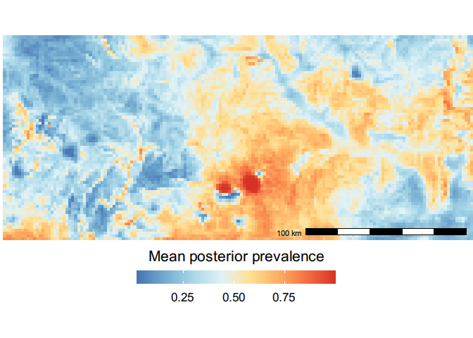<!-- -->

``` r
# Plot mean sd
pal_res <- colorRampPalette(brewer.pal(8, name = "Blues"), interpolate = "linear", space = "Lab")
sd_prev <- ggplot_raster(rast = r_prev_sd, rast_name = "Uncertainty (SD posterior prevalence)")

sd_prev
```

    ## Warning: Removed 389 rows containing missing values (geom_raster).

    ## Using plotunit = 'm'

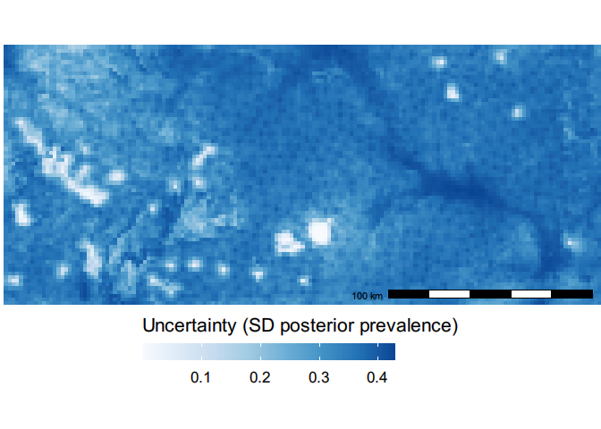<!-- -->
