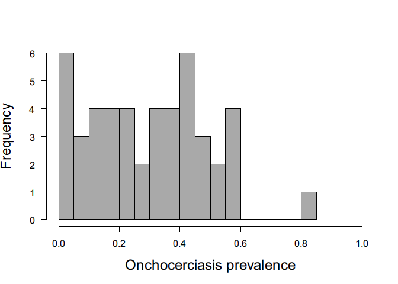
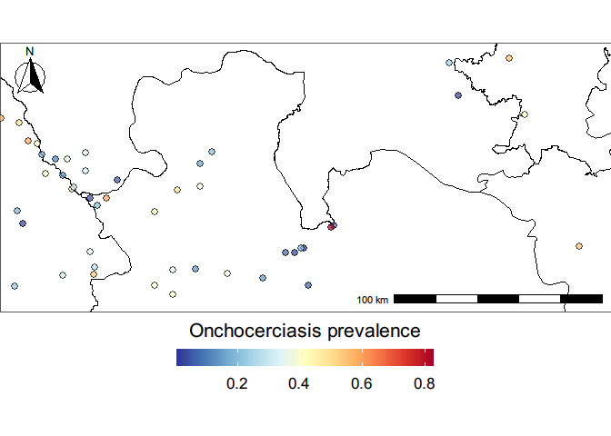
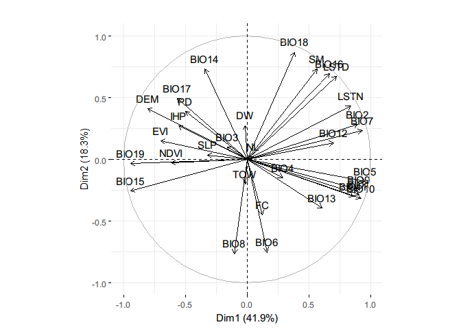
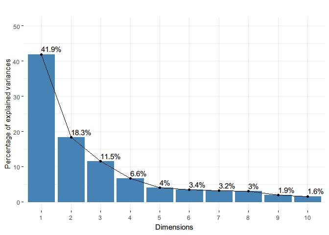
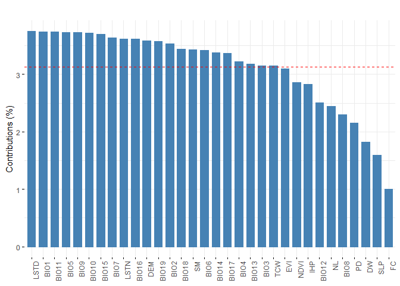

## Introduction

The data is obtained from [ESPEN
database](https://espen.afro.who.int/tools-resources/download-data)

## Load libraries

``` r
extrafont::loadfonts(device="win", quiet = T)
```

``` r
suppressMessages({library(sf);
  library(tidyverse);
  # library(ggplot2);
  library(rgdal);
  # library(leaflet);
  library(raster);
  library(RColorBrewer);
  # library(tmap);
  # library(gstat);
  # library(tidyr);
  library(rgeos);
  library(ggspatial);
  })
```

    ## Warning: package 'sf' was built under R version 4.1.2

    ## Warning: package 'tidyverse' was built under R version 4.1.1

    ## Warning: package 'ggplot2' was built under R version 4.1.1

    ## Warning: package 'tibble' was built under R version 4.1.2

    ## Warning: package 'tidyr' was built under R version 4.1.1

    ## Warning: package 'readr' was built under R version 4.1.2

    ## Warning: package 'rgdal' was built under R version 4.1.2

    ## Warning: package 'raster' was built under R version 4.1.3

    ## Warning: package 'rgeos' was built under R version 4.1.2

    ## Warning: package 'ggspatial' was built under R version 4.1.2

## Loading the data

``` r
ghana_prev_site <- read.csv("data/data-GH-Oncho-sitelevel.csv", header = T)

ghana_prev_clean <- ghana_prev_site %>% filter(Georeliability == 1)

ghana_prev_clean2 <- ghana_prev_clean %>% dplyr::select(IU_NAME, IU_ID, LocationName, Longitude, Latitude, SurveyYear, Period, SurveyMonth, Method_0, Method_1, Method_2, Examined, Positive, Prevalence) %>% mutate(IU_NAME = as.factor(IU_NAME), IU_ID = as.numeric(IU_ID), LocationName = as.factor(LocationName), Longitude = as.numeric(Longitude), Latitude  = as.numeric(Latitude), SurveyYear = as.numeric(SurveyYear), SurveyMonth = as.factor(SurveyMonth), Period = as.factor(Period), Method_0 = as.factor(Method_0), Method_1 = as.factor(Method_1), Method_2 = as.factor(Method_2), Examined = as.numeric(Examined), Positive = as.numeric(Positive), Prevalence = as.numeric(Prevalence))
```

    ## Warning in mask$eval_all_mutate(quo): NAs introduced by coercion

    ## Warning in mask$eval_all_mutate(quo): NAs introduced by coercion

    ## Warning in mask$eval_all_mutate(quo): NAs introduced by coercion

``` r
summary(ghana_prev_clean2)
```

    ##                  IU_NAME        IU_ID                     LocationName
    ##  Wa East             : 76   Min.   :21380   HIAMPE              : 16  
    ##  Pru                 : 71   1st Qu.:21425   ASUBENDE            : 15  
    ##  Banda               : 56   Median :21519   FAOWOMANG           : 15  
    ##  Bole                : 56   Mean   :21500   WIDENABA            : 12  
    ##  Kassena Nankana West: 40   3rd Qu.:21549   KAYORO BALIU (DETAIL: 11  
    ##  West Gonja          : 35   Max.   :21603   KULUN               : 11  
    ##  (Other)             :745   NA's   :6       (Other)             :999  
    ##    Longitude          Latitude        SurveyYear           Period   
    ##  Min.   :-2.9210   Min.   : 4.992   Min.   :1975   2001 - 2005:117  
    ##  1st Qu.:-2.0422   1st Qu.: 7.758   1st Qu.:1990   2006 - 2010:197  
    ##  Median :-1.3500   Median : 8.730   Median :1998   2011 - 2016:104  
    ##  Mean   :-1.2618   Mean   : 8.801   Mean   :1997   Before 2001:661  
    ##  3rd Qu.:-0.4899   3rd Qu.:10.130   3rd Qu.:2006                    
    ##  Max.   : 1.0357   Max.   :11.089   Max.   :2013                    
    ##                                                                     
    ##    SurveyMonth               Method_0              Method_1   
    ##          :247                    :247   Parasitological:1079  
    ##  November:120   Impact Assessment:500                         
    ##  May     :108   Mapping          :332                         
    ##  October :101                                                 
    ##  December: 93                                                 
    ##  January : 92                                                 
    ##  (Other) :318                                                 
    ##                        Method_2       Examined        Positive     
    ##  Parasitology (Skin biopsy):1079   Min.   :  0.0   Min.   :  0.00  
    ##                                    1st Qu.: 98.5   1st Qu.:  2.00  
    ##                                    Median :147.0   Median :  9.00  
    ##                                    Mean   :175.5   Mean   : 37.37  
    ##                                    3rd Qu.:231.0   3rd Qu.: 43.00  
    ##                                    Max.   :925.0   Max.   :576.00  
    ##                                                    NA's   :2       
    ##    Prevalence     
    ##  Min.   :0.00000  
    ##  1st Qu.:0.01575  
    ##  Median :0.06985  
    ##  Mean   :0.17954  
    ##  3rd Qu.:0.26852  
    ##  Max.   :0.88851  
    ##  NA's   :2

``` r
# All the data from skin snipping - no REMO data

# Select the data used for mapping
ghana_prev_clean3 <- ghana_prev_clean2 %>% dplyr::select(Longitude, Latitude, SurveyYear, Period, Method_0, Examined, Positive, Prevalence) %>% mutate()

table(ghana_prev_clean3$Period, ghana_prev_clean3$Method_0)
```

    ##              
    ##                   Impact Assessment Mapping
    ##   2001 - 2005   0                95      22
    ##   2006 - 2010 143                54       0
    ##   2011 - 2016 104                 0       0
    ##   Before 2001   0               351     310

``` r
# Most of the data that does not have the label were collected between 2006 - 2016
```

``` r
## Ghana map boundary - level 1/updated
ghana_map_1 <- readOGR("data/gadm41_GHA_shp/gadm41_GHA_1.shp", verbose = FALSE) %>% st_as_sf()
```

### Convert to spatial object

``` r
coordinates(ghana_prev_clean3) <- (ghana_prev_clean3[, c("Longitude","Latitude")])

ghana_prev_sf <- ghana_prev_clean3 %>% st_as_sf() 
st_crs(ghana_prev_sf) = 4326

# convert to UTM - planar CRS transformation
epsg_ghana_UTM <- 32630
st_crs(epsg_ghana_UTM)$proj4string
```

    ## [1] "+proj=utm +zone=30 +datum=WGS84 +units=m +no_defs"

``` r
utm_proj_ghana <- st_crs(epsg_ghana_UTM)$proj4string  # "+proj=utm +zone=30 +datum=WGS84 +units=m +no_defs"

ghana_prev_sf <- ghana_prev_sf %>% st_transform(crs = utm_proj_ghana)
ghana_prev_sp <- as(ghana_prev_sf, "Spatial")
```

### Spatial filtering to transition region

``` r
bbox_transition <- readRDS("data/bbox_buffer_transition_ghana.rds") %>% st_as_sf()

# filtering the prevalence data
GT_prev_sp <- intersect(x = ghana_prev_sp, y = bbox_transition)
```

``` r
GT_prev_clean <- data.frame(GT_prev_sp)
GT_prev_clean <- GT_prev_clean %>% mutate(LONG = coords.x1, LAT = coords.x2, optional = NULL) %>% mutate(coords.x1 = NULL, coords.x2 = NULL, Longitude = NULL, Latitude = NULL)

## Omitting observations with missing data
GT_prev_clean <- na.omit(GT_prev_clean)

## Selecting only mapping data
GT_prev_mapping <- GT_prev_clean %>% filter(Method_0 == "Mapping")
```

### Find duplicate observations

``` r
find_duplicate <- function(df){
  i <- duplicated(df[, c("LONG", "LAT")])
  long_dup <- df[i, ]$LONG
  lat_dup <- df[i, ]$LAT
  duplicate_sites <- df %>% filter(LONG %in% long_dup & LAT %in% lat_dup)
  return(duplicate_sites)
}

(duplicate_mf <- find_duplicate(df = GT_prev_mapping))
```

    ##    SurveyYear      Period Method_0 Examined Positive Prevalence     LONG
    ## 1        1980 Before 2001  Mapping      162      116 0.71604938 702844.5
    ## 2        2004 2001 - 2005  Mapping      663       51 0.07692308 702844.5
    ## 3        1976 Before 2001  Mapping      168       97 0.57738095 558336.0
    ## 4        1976 Before 2001  Mapping      168       97 0.57738095 558336.0
    ## 5        1987 Before 2001  Mapping      104       52 0.50000000 567145.2
    ## 6        1987 Before 2001  Mapping      104       52 0.50000000 567145.2
    ## 7        1987 Before 2001  Mapping      175       58 0.33142857 579830.3
    ## 8        1987 Before 2001  Mapping      175       58 0.33142857 579830.3
    ## 9        1987 Before 2001  Mapping      106       50 0.47169811 579830.3
    ## 10       1987 Before 2001  Mapping      102       48 0.47058824 579830.3
    ## 11       1987 Before 2001  Mapping      156      129 0.82692308 717133.8
    ## 12       1980 Before 2001  Mapping      112       66 0.58928571 571563.1
    ## 13       1980 Before 2001  Mapping      112       66 0.58928571 571563.1
    ## 14       1987 Before 2001  Mapping      155      129 0.83225806 717133.8
    ## 15       1987 Before 2001  Mapping       37        4 0.10810811 584792.7
    ## 16       1987 Before 2001  Mapping       37        4 0.10810811 584792.7
    ## 17       1987 Before 2001  Mapping       67       20 0.29850746 593631.1
    ## 18       1987 Before 2001  Mapping       67       20 0.29850746 593631.1
    ## 19       1980 Before 2001  Mapping      312      127 0.40705128 588064.2
    ## 20       1994 Before 2001  Mapping      102        2 0.01960784 588064.2
    ## 21       1980 Before 2001  Mapping      186       78 0.41935484 566577.5
    ## 22       1989 Before 2001  Mapping      453       37 0.08167770 566577.5
    ## 23       1989 Before 2001  Mapping      443      104 0.23476298 565057.6
    ## 24       1994 Before 2001  Mapping       46        5 0.10869565 565057.6
    ##         LAT
    ## 1  874796.6
    ## 2  874796.6
    ## 3  937403.0
    ## 4  937403.0
    ## 5  935204.7
    ## 6  935204.7
    ## 7  910741.9
    ## 8  910741.9
    ## 9  910741.9
    ## 10 910741.9
    ## 11 884817.5
    ## 12 926367.0
    ## 13 926367.0
    ## 14 884817.5
    ## 15 917545.8
    ## 16 917545.8
    ## 17 904296.0
    ## 18 904296.0
    ## 19 861895.4
    ## 20 861895.4
    ## 21 892960.3
    ## 22 892960.3
    ## 23 856705.3
    ## 24 856705.3

``` r
GT_prev_mapdiff <- GT_prev_mapping[ !(GT_prev_mapping$LONG %in% duplicate_mf$LONG), ]
GT_prev_mapdiff %>% summary ## all collected before 2001
```

    ##    SurveyYear           Period                Method_0     Examined    
    ##  Min.   :1978   2001 - 2005: 1                    : 0   Min.   : 28.0  
    ##  1st Qu.:1982   2006 - 2010: 0   Impact Assessment: 0   1st Qu.: 88.5  
    ##  Median :1994   2011 - 2016: 0   Mapping          :36   Median :173.0  
    ##  Mean   :1990   Before 2001:35                          Mean   :180.5  
    ##  3rd Qu.:1997                                           3rd Qu.:240.5  
    ##  Max.   :2001                                           Max.   :601.0  
    ##     Positive        Prevalence            LONG             LAT        
    ##  Min.   :  1.00   Min.   :0.006579   Min.   :568861   Min.   :852450  
    ##  1st Qu.:  8.75   1st Qu.:0.115566   1st Qu.:601398   1st Qu.:870818  
    ##  Median : 37.50   Median :0.292644   Median :641146   Median :897130  
    ##  Mean   : 52.94   Mean   :0.269341   Mean   :656001   Mean   :895854  
    ##  3rd Qu.: 56.00   3rd Qu.:0.402764   3rd Qu.:696237   3rd Qu.:916135  
    ##  Max.   :224.00   Max.   :0.600000   Max.   :836335   Max.   :966105

``` r
# Clean duplicate mf. If all the variables are same, keep only one observation. For, the ones with different prevalence, calculate average  
duplicate_mf2 <- duplicate_mf %>% distinct()
GT_unique_prev <- duplicate_mf2 %>% group_by(LONG, LAT) %>% summarise(Examined = sum(Examined), Positive = sum(Positive), Prevalence = Positive/Examined) 
```

    ## `summarise()` has grouped output by 'LONG'. You can override using the `.groups` argument.

``` r
## select required columns and merge the dataframe
GT_unique_prevmap <- GT_prev_mapdiff %>% dplyr::select(LONG, LAT, Examined, Positive, Prevalence) %>% rbind(GT_unique_prev)
```

## Visualise the prevalence data

### Prevalence histogram

``` r
hist(GT_unique_prevmap$Prevalence, main = "",
     xlab="Onchocerciasis prevalence", ylab = ("Frequency"),
     border="black", 
     col="darkgrey", xlim=c(0,1), cex.lab=1.5, cex.axis=1, cex.main=2, cex.sub=2,
    #  ylim = c(0,225),
     las=1, 
     breaks=25)
```



### Ghana prevalence on a map

``` r
# GT_prevmap_sf <- st_as_sf(x = GT_unique_prevmap, coords = c('LONG','LAT'), crs= "+proj=utm +zone=30 +datum=WGS84 +units=m +no_defs")

ghana_map_1_sfutm <- ghana_map_1 %>% st_transform(crs = "+proj=utm +zone=30 +datum=WGS84 +units=m +no_defs")
```

``` r
mypalette <- colorRampPalette(rev(brewer.pal(11, "RdYlBu")))

p <- ggplot(ghana_map_1_sfutm) + 
  geom_sf(col = "black", lty = 1, alpha = 0.01) + coord_sf() +
  geom_sf(data = bbox_transition, alpha = 0) +
  geom_point(data = GT_unique_prevmap, aes(LONG, LAT, fill = Prevalence), color = "black", size = 2, stroke = 1, shape = 21, alpha = .7)+ labs(fill = "Onchocerciasis prevalence") +
  scale_fill_gradientn(colours = mypalette(100)) +
  scale_y_continuous(name=expression(paste("Latitude (",degree,")")), limits=c(844447.4, 973827),expand=c(0,0))+
  scale_x_continuous(name = expression(paste("Longitude (",degree,")")), limits=c(557845.6, 851520.9),expand=c(0,0)) + 
  annotation_scale(location = "br", width_hint = 0.5) +
  annotation_north_arrow(location = "tl", which_north = "true",
        pad_x = unit(0.05, "in"), pad_y = unit(0.05, "in"),
        style = north_arrow_fancy_orienteering) +
  theme_void(base_family = "Arial", base_size = 16) +
  theme(legend.position = "bottom", legend.key.size = unit(2, 'cm'), #change legend key size
        legend.key.height = unit(.5, 'cm'), #change legend key height
        legend.key.width = unit(1.5, 'cm')) +
  guides(fill = guide_colourbar(title.position="top", title.hjust = 0.5))
```

    ## Coordinate system already present. Adding new coordinate system, which will replace the existing one.

``` r
p
```



# Variable selection

## Loading the data

``` r
# GT_prev <- read.csv("data/220228_GT_uniqueprev.csv")
cov_prev <- stack("data/220228_cov_prev.grd")
```

## Extract point data from raster covriates

``` r
covs <- raster::extract(cov_prev, GT_unique_prevmap[c("LONG","LAT")], na.rm = TRUE, df = TRUE)

data_c_covs <- as.data.frame(cbind(GT_unique_prevmap, covs))
data_c_covs <- na.omit(data_c_covs)
data_c_covs %>% head()
```

    ##       LONG      LAT Examined Positive Prevalence ID elevation
    ## 1 603634.2 865620.0      108       29 0.26851852  1  256.7227
    ## 2 588112.0 909812.9      193       27 0.13989637  2  109.1577
    ## 3 614553.8 907662.3       46        2 0.04347826  3  108.7562
    ## 4 603122.1 862178.0      281      153 0.54448399  4  264.8680
    ## 7 568861.2 886549.3      290        6 0.02068966  5  241.4167
    ## 8 578181.1 919744.7       29        5 0.17241379  6  114.9692
    ##   annual_mean_temperature annual_diurnal_range isothermality
    ## 1                260.3126              96.0000      67.00000
    ## 2                275.1758             104.0000      67.00000
    ## 3                276.0000             105.0000      67.00000
    ## 4                259.0929              95.0000      67.00000
    ## 7                265.0000              99.5442      66.12994
    ## 8                275.0000             104.9360      66.57626
    ##   temperature_seasonality maximum_temperature_warmest_month
    ## 1                1370.422                          342.8198
    ## 2                1367.420                          361.0202
    ## 3                1337.107                          362.0000
    ## 4                1349.225                          341.0929
    ## 7                1371.592                          350.4142
    ## 8                1370.418                          360.9129
    ##   minimum_temperature_coldest_month temperature_annual_range
    ## 1                          200.8198                 142.0000
    ## 2                          206.6859                 154.3343
    ## 3                          207.0000                 155.0000
    ## 4                          200.5943                 140.4986
    ## 7                          201.0000                 149.4143
    ## 8                          204.5763                 156.3367
    ##   mean_temperature_wettest_quarter mean_temperature_driest_quarter
    ## 1                         266.3932                        265.3126
    ## 2                         280.8213                        279.1758
    ## 3                         282.0000                        280.0000
    ## 4                         265.0929                        264.0929
    ## 7                         270.1299                        270.4142
    ## 8                         281.0000                        278.9129
    ##   mean_temperature_warmest_quarter mean_temperature_coldest_quarter
    ## 1                         279.8198                         243.9003
    ## 2                         295.1758                         258.6657
    ## 3                         295.0000                         259.4172
    ## 4                         278.0929                         243.0929
    ## 7                         284.0000                         247.4523
    ## 8                         295.0000                         258.0640
    ##   annual_precpitation precipitation_wettest_month precipitation_driest_month
    ## 1            1245.982                    192.5073                          6
    ## 2            1145.575                    192.3343                          4
    ## 3            1187.566                    201.8696                          4
    ## 4            1247.350                    190.8158                          6
    ## 7            1171.430                    184.8701                          6
    ## 8            1123.089                    191.0000                          4
    ##   precipitation_seasonality precipitation_wettest_quarter
    ## 1                        62                      478.7680
    ## 2                        66                      446.0000
    ## 3                        66                      458.8696
    ## 4                        62                      479.0617
    ## 7                        63                      458.4558
    ## 8                        66                      436.1525
    ##   precipitation_dreist_quarter precipitation_warmest_quarter
    ## 1                     46.91943                      269.7726
    ## 2                     33.00000                      224.0000
    ## 3                     32.00000                      226.0000
    ## 4                     47.74456                      273.1503
    ## 7                     44.00000                      253.0000
    ## 8                     32.00000                      216.5763
    ##   precipitation_coldest_quarter LST_day_01 LST_night_01      slope
    ## 1                      396.7682   30.07287     19.94475 1.33048761
    ## 2                      408.5746   30.90093     21.46735 0.58675325
    ## 3                      429.0260   31.43398     21.12778 0.07920054
    ## 4                      393.3049   29.87246     20.07475 1.48367167
    ## 7                      381.7401   30.34359     20.45431 0.45684439
    ## 8                      409.3597   29.26442     23.61282 0.35127243
    ##   NDVI01_GT_utm EVI01_GT_utm LC01_GT_utm    FC_GT_utm TCW01_GT_utm
    ## 1     0.5244576    0.3339696           9 1.742969e+01   -0.2002104
    ## 2     0.4556449    0.2746002          10 1.183467e+05   -0.1810302
    ## 3     0.5049389    0.3101701           9 1.519873e+00   -0.1903145
    ## 4     0.5310169    0.3493243           9 6.029897e+01   -0.2011503
    ## 7     0.4929552    0.3225602           9 6.116869e+00   -0.1873442
    ## 8     0.4829980    0.2926895           9 1.261551e+05   -0.1592649
    ##   SM0001_GT_utm distwater_GT_utm popden0001_GT_utm housing2001_GT_utm
    ## 1      43.14625         2.357787         64.345070         0.09177501
    ## 2      30.68377         0.277513         10.470739         0.05658718
    ## 3      33.54677         2.544718          9.227164         0.04275714
    ## 4      43.91314         1.476453         64.345070         0.11095008
    ## 7      36.54363         4.867418         21.702955         0.04898965
    ## 8      28.79205         0.475351         16.636055         0.03894942
    ##   nightlights0001_GT_utm
    ## 1                      0
    ## 2                      0
    ## 3                      0
    ## 4                      0
    ## 7                      0
    ## 8                      0

## Prevalence data: Variable selection

``` r
data_c_covs[, c("Examined", "Positive", "LONG", "LAT", "ID")] <- NULL
```

``` r
temp_covariates <- c(names(data_c_covs)[c(3:13, 22:23)], "Prevalence")
temp_data <- data_c_covs[, temp_covariates]

precip_covariates <- c(names(data_c_covs)[14:21], "Prevalence")
precip_data <- data_c_covs[, precip_covariates]

elev_data <- data_c_covs[, c("elevation", "slope", "Prevalence")]
vegind_data <- data_c_covs[, c("EVI01_GT_utm", "NDVI01_GT_utm", "Prevalence")]
hydro_data <- data_c_covs[, c("FC_GT_utm", "TCW01_GT_utm", "SM0001_GT_utm", "distwater_GT_utm", "Prevalence")]

sociodem_data <- data_c_covs[, c("popden0001_GT_utm",
                          "housing2001_GT_utm", "nightlights0001_GT_utm", "Prevalence")]
```

``` r
covs_prev <- data_c_covs %>% dplyr::select(annual_mean_temperature, annual_diurnal_range, temperature_seasonality, maximum_temperature_warmest_month, minimum_temperature_coldest_month, temperature_annual_range, mean_temperature_wettest_quarter, mean_temperature_driest_quarter, mean_temperature_warmest_quarter, mean_temperature_coldest_quarter, isothermality, LST_day_01, LST_night_01, annual_precpitation, precipitation_wettest_month, precipitation_driest_month, precipitation_wettest_quarter, precipitation_dreist_quarter, precipitation_warmest_quarter, precipitation_coldest_quarter, precipitation_seasonality, elevation, slope, NDVI01_GT_utm, EVI01_GT_utm, FC_GT_utm, distwater_GT_utm, TCW01_GT_utm, SM0001_GT_utm, popden0001_GT_utm, housing2001_GT_utm, nightlights0001_GT_utm)

names(covs_prev) <- c("BIO1", "BIO2", paste0("BIO",4:11), "BIO3", paste0("BIO",c(12:14,16:19)), "BIO15", "LSTD", "LSTN", "DEM", "SLP", "NDVI", "EVI", "FC", "DW", "TCW", "SM", "PD", "IHP", "NL")
```

### PCA analysis

``` r
library(FactoMineR)
```

    ## Warning: package 'FactoMineR' was built under R version 4.1.2

``` r
library(factoextra)
```

    ## Warning: package 'factoextra' was built under R version 4.1.2

    ## Welcome! Want to learn more? See two factoextra-related books at https://goo.gl/ve3WBa

``` r
res.pca <- PCA(covs_prev, scale.unit = TRUE, graph = FALSE)
p_pca <- fviz_pca_var(res.pca, col.var = "black") + ggtitle("")
p_pca
```



``` r
# eig.val <- get_eigenvalue(res.pca)
```

``` r
p_scree <- fviz_eig(res.pca, addlabels = TRUE, ylim = c(0, 50)) + ggtitle("")
p_scree
```



``` r
# var <- get_pca_var(res.pca)
```

``` r
# p <- fviz_cos2(res.pca, choice = "var", axes = 1:3)
```

-   Upto 5 axis included because the cumulative variance explained is
    greater than 80%

``` r
p_contrib <- fviz_contrib(res.pca, choice = "var", axes = 1:5, top = 100) + theme(axis.text.x = element_text(angle=90)) + ggtitle("")
p_contrib
```


